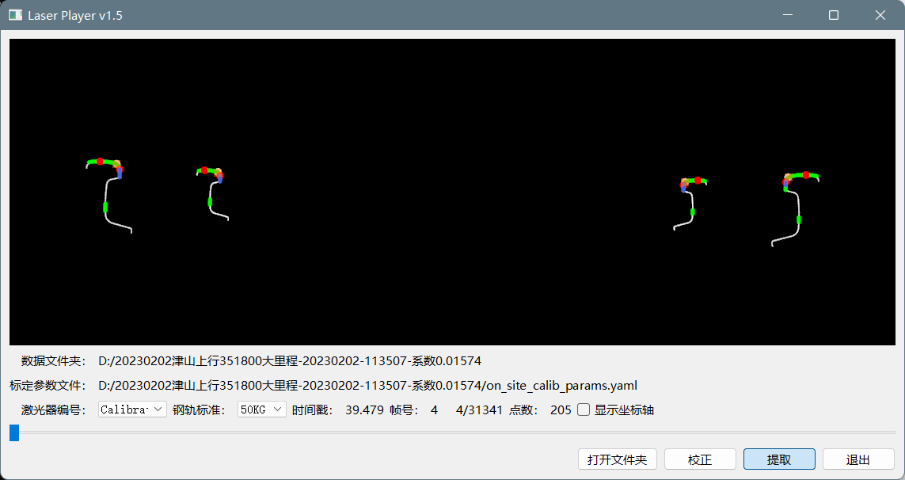
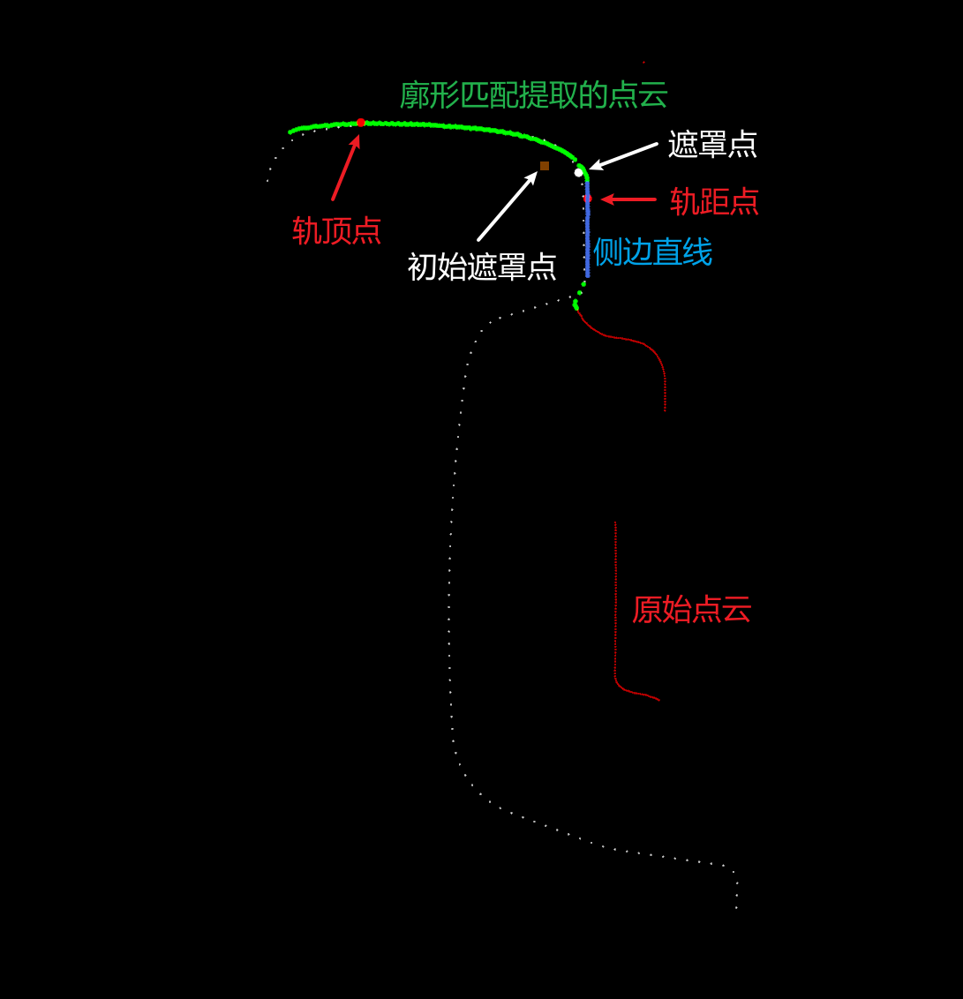

# LaserPlayer

## 命令行格式

### 参数说明

程序名称 `laser_player.exe`，命令行参数如下：

| 参数                 | 含义                                                 |
| -------------------- | :--------------------------------------------------- |
| --help               | 显示帮助信息                                         |
| --in arg             | 输入激点云文件目录。                                 |
| --calib arg          | 输入标定参数文件名称。                               |
| --rail-std arg (=60) | 轨道标准（默认 60kg 轨）。                           |
| --no-gnss arg        | 没有GNSS，只使用里程计。                             |
| --manpos arg         | 初始位置，输入顺序为：纬度（°）经度（°） 高度（m）。 |

### 示例

```bash
laser_player.exe --in D:/大轨检数据/20230206唐包上行96+600-93+000小里程 系数0.01574 --calib D:/大轨检数据/20230206唐包上行96+600-93+000小里程 系数0.01574/on_site_calib_params.yaml --rail-std 60 --no-gnss --manpos 39.6908666934889 118.058701300878 33.5709948123284
```

### LOG 文件

在程序所在目录下的 `log` 文件夹包含历次处理的记录文件，会占用空间，可以清理。

## GUI操作说明

程序名称 `laser_player_gui.exe`。用来检查激光和特征提取情况。



- `左右键` —— 以单帧步进；

- `shift+左右键` —— 以10帧步进；

- `ctrl+左右键` —— 以100帧步进；

- `ctrl+shift+左右键` —— 以1000帧步进；

- `r` —— 恢复视角；

- `o` —— 切换透视/正视（在正视图下，恢复视角有 bug，先切换到透视图，恢复视角后，再切换回正视图）；

- `激光器编号` —— `0`——左前，`2`——右前，`3`——左后，`1`——右后，`Calibrated`  —— 校正后同时显示4个廓形；

- `钢轨标准` —— 可以选择 50kg 或 60kg，默认 60kg。

- `打开文件夹` —— 打开包含激光器数据的文件夹下所有的文件，激光器编号自动从文件名中提取，相同编号的激光器数据会拼接到一起；

- `校正` —— 读取标定参数文件（`.yaml`），对点云位姿进行校正。校正后会在下来菜单中增加 `Calibrated` 选项，选中后会同时显示所有点云的相对位置，坐标原点代表惯导系统测量中心。

  `.yaml` 文件格式如下，可以由 `beam_calibr` 生成，下载地址 [rail-check/BeamCalib-Release: 轨检梁标定程序 (github.com)](https://github.com/rail-check/BeamCalib-Release)。

  ```yaml
  %YAML:2.0
  ---
  # 安装误差
  Laser0:
     Transform: !!opencv-matrix
        rows: 4
        cols: 4
        dt: f
        data: [ 8.08076918e-01, 5.89076757e-01, 0., -7.35984436e+02,
            -5.89076757e-01, 8.08076918e-01, 0., -3.01532349e+02, 0., 0.,
            1., -2.68500000e+02, 0., 0., 0., 1. ]
     Inverse: 1
  Laser1:
     Transform: !!opencv-matrix
        rows: 4
        cols: 4
        dt: f
        data: [ 8.35906982e-01, -5.48871040e-01, 0., 7.25698608e+02,
            5.48871040e-01, 8.35906982e-01, 0., -3.24404480e+02, 0., 0.,
            1., 2.68500000e+02, 0., 0., 0., 1. ]
     Inverse: 0
  Laser2:
     Transform: !!opencv-matrix
        rows: 4
        cols: 4
        dt: f
        data: [ 8.33538294e-01, -5.52462459e-01, 0., 7.23198914e+02,
            5.52462459e-01, 8.33538294e-01, 0., -3.24730316e+02, 0., 0.,
            1., -2.68500000e+02, 0., 0., 0., 1. ]
     Inverse: 1
  Laser3:
     Transform: !!opencv-matrix
        rows: 4
        cols: 4
        dt: f
        data: [ 8.13677609e-01, 5.81317306e-01, 0., -7.36984558e+02,
            -5.81317306e-01, 8.13677609e-01, 0., -3.04212616e+02, 0., 0.,
            1., 2.68500000e+02, 0., 0., 0., 1. ]
     Inverse: 0
  ```

- `提取` —— 对轨道廓形和特征进行提取。

- 点云图像注释

  

